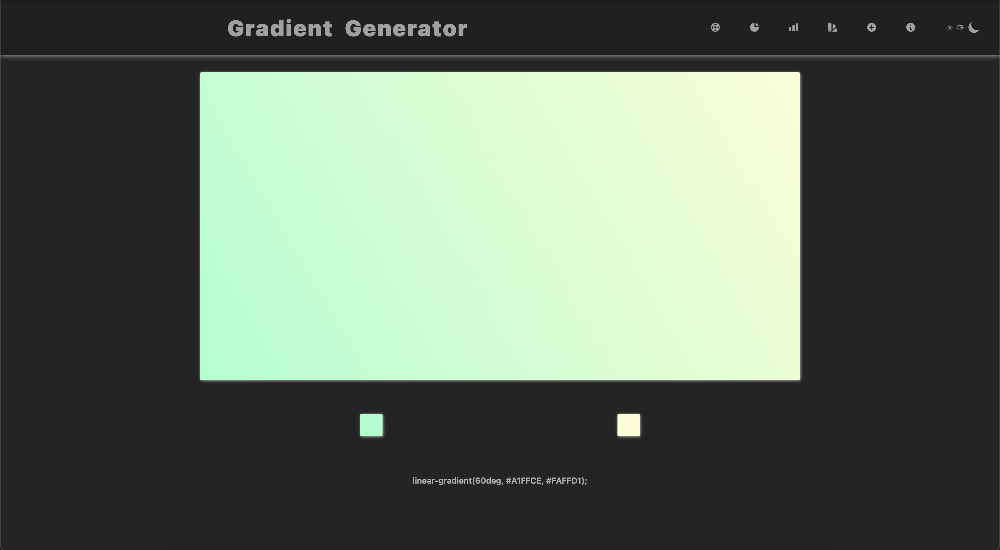
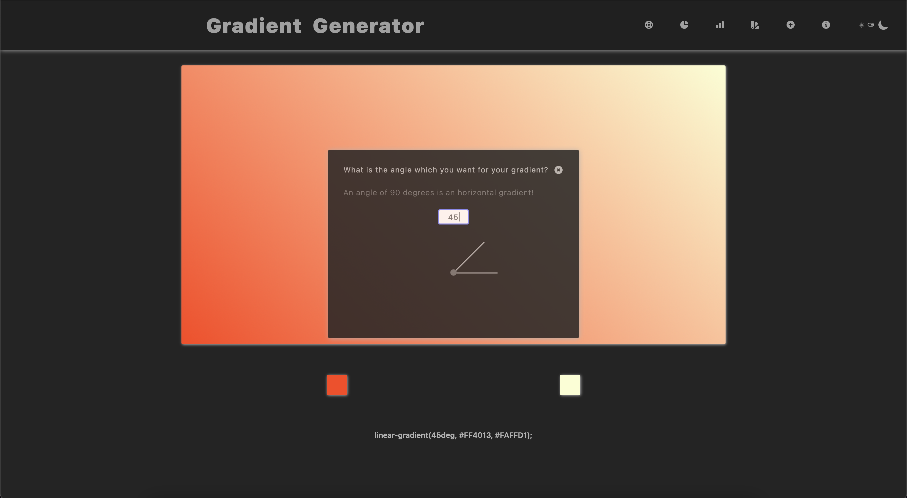
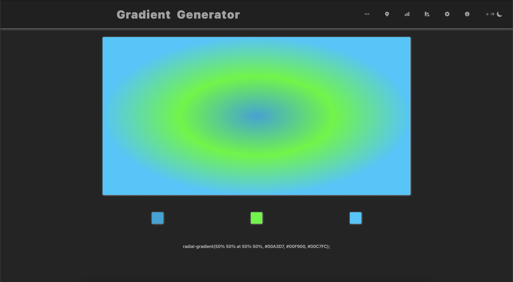
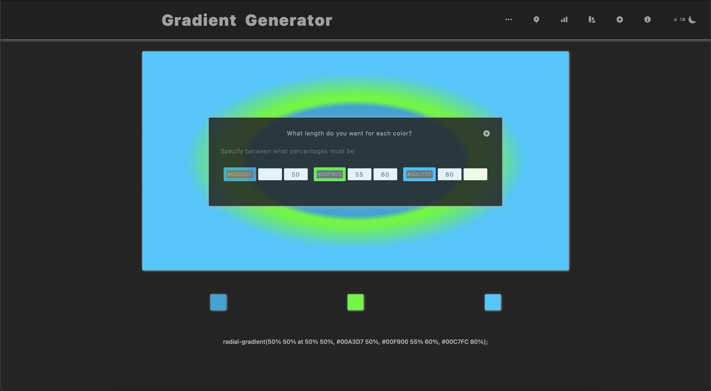
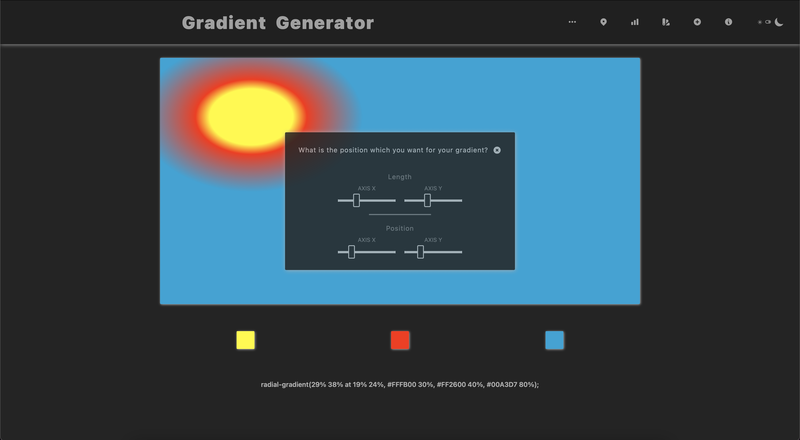

# Gradient Generator by Alej RG

---

### Customize your gradients and copy the css code

---

---

---

---

---

## Upcoming

1. Draggable Popups
2. Improve length function
3. Section with popular gradients
4. Section to create color palettes

---

- This project is made by a beginner developer to learning about technologies used.

    - I wanted to learn with this project about *React.js*, *styled-components*, *TypeScript*, *Git* and *Test Driven
      Development* with *React Testing Library* .
